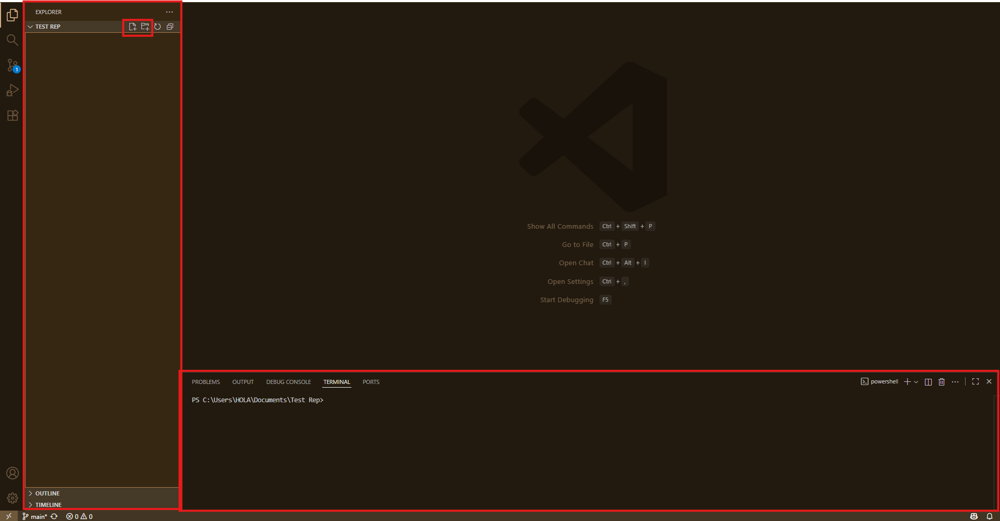
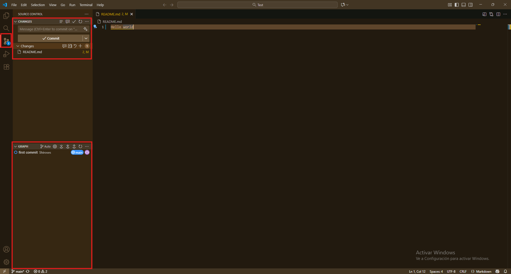
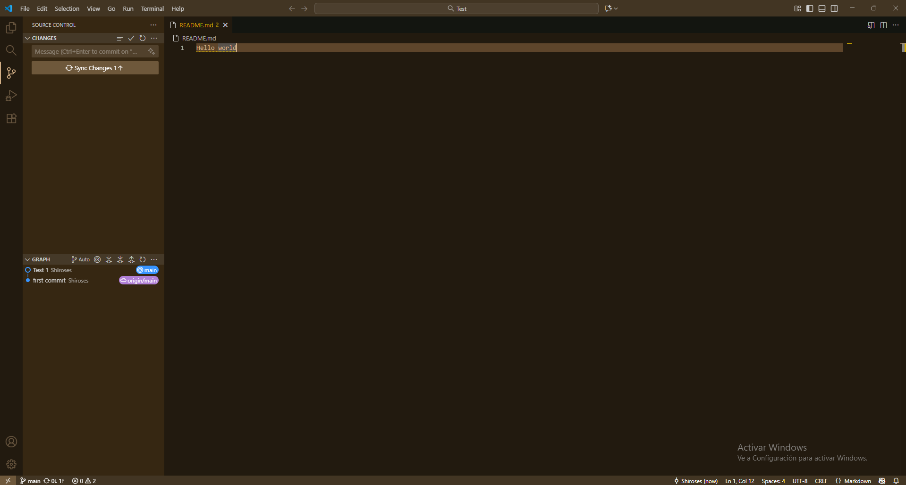
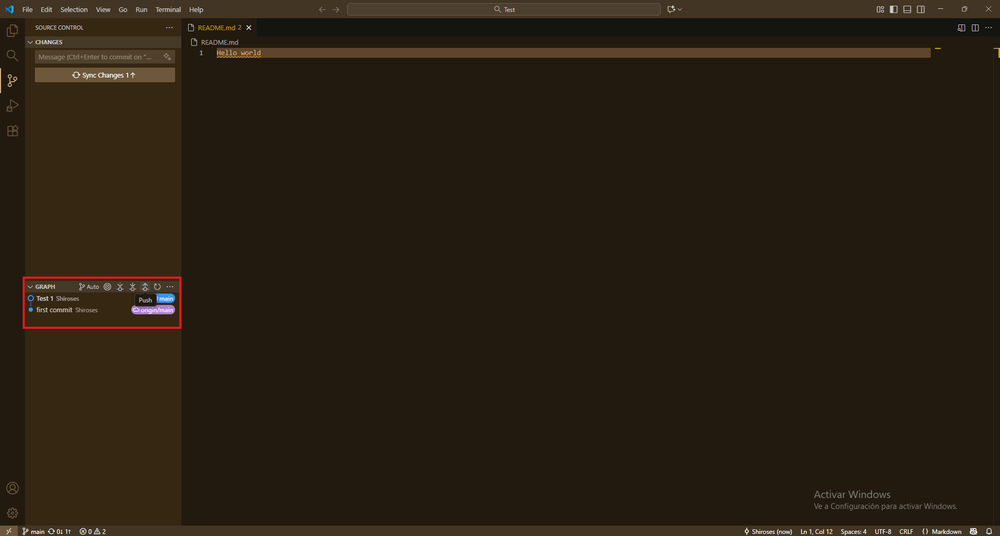

# 🚀 Empezando con GitHub

## 🚩 Haciendo tu primer commit

Una vez que tengas tu repositorio creado y conectado con VS Code, puedes empezar a enviar cambios desde tu editor al repositorio en GitHub.

Existen varias formas de hacerlo. Aquí veremos las más comunes: usando la **terminal integrada** y la **interfaz gráfica de VS Code**. ¡Empecemos!

> 💡 **Recuerda:**  
> Un *commit* es como un "guardado" del estado de tus archivos editados. Esto te permite corregir errores, ver el historial de cambios y saber quién hizo cada modificación.

---

### 💻 Commit desde la terminal integrada

1. **Abrir la terminal integrada**  
   Usa el atajo `Ctrl + Shift + ñ` o ``Ctrl + Shift + ` `` para abrir una nueva terminal, o ve al menú `Terminal` en la parte superior y selecciona `Nueva Terminal`.

   

2. **Preparar los archivos para el commit**  
   Indica a Git cuáles archivos quieres preparar con el comando:

   ```bash
   git add README.md
   ```

> Si quieres preparar todos los archivos modificados, puedes usar: ```git add .```

3. **Hacer el commit**  
   Guarda los cambios preparados con el siguiente comando:

   ```bash
   git commit -m "Mensaje descriptivo del commit"
   ```

> 💡 **Tip:**  
> Puedes saltarte el `git add .` si usas:
>
> ```bash
> git commit -a -m "Mensaje descriptivo del commit"
> ```
>
> La opción `-a` prepara automáticamente todos los archivos editados y los incluye en el commit.  
> **Úsalo solo cuando estés seguro de los cambios que realizaste!**.

> 📝 **Recomendación:**  
> El mensaje del commit debe ser claro y explicar brevemente qué cambios realizaste. Esto facilita el seguimiento y la colaboración en el proyecto.

4. **Publicar los cambios en Github**  
   Sube tu commit al repositorio remoto con:

   ```bash
   git push origin main
   ```
> Recuerda: `main` es la rama principal. Cambia estos valores con los nombres respectivos

Con esto terminamos de hacer el commit desde la terminal. Como puedes ver, es un proceso sencillo y rápido que te permitirá mantener tu proyecto actualizado en GitHub.

### 🟣 Commit desde VS Code

1. **Ir al control de versiones**  
   Haz clic en el ícono de control de versiones (generalmente tres puntos unidos formando una ramificación) en la barra lateral izquierda.

   Aquí verás dos herramientas principales:
   - **Pestaña de cambios y staging:** donde puedes preparar archivos para el commit.
   - **Pestaña de historial:** donde puedes ver los commits realizados y sus mensajes.

   

2. **Preparar archivos para el commit**  
   En la pestaña de cambios, al pasar el mouse sobre "Changes" verás varios íconos:
   - El ícono `+` en la pestaña Changes prepara **todos** los archivos editados o agregados.
   - El ícono `+` junto a cada archivo prepara **solo ese archivo**.

   

3. **Hacer el commit**  
   Una vez seleccionados los archivos, aparecerán como preparados y el botón de **Commit** se volverá azul. Escribe un mensaje descriptivo y haz clic en el botón para realizar el commit.

   

> 📝 **Recuerda:**  
> El mensaje del commit debe ser claro y explicar brevemente qué cambios realizaste. Esto facilita el seguimiento y la colaboración en el proyecto.

  

4. **Publicar los cambios (Push) al repositorio**  
   Tienes dos formas de subir tus cambios a GitHub:
   - **Botón de sincronizar:** Toma el archivo editado más reciente y sincroniza entre tu computadora y el repositorio trayendo tambien los archivos mas recientes. Es útil para proyectos personales donde sabes exactamente qué se ha editado.
   - **Botón de push en la pestaña de historial:** Publica el último commit hecho en tu computadora, pero **no** trae cambios del repositorio remoto.

   

---

Realizar commits y publicar tus cambios en GitHub desde VS Code es un proceso sencillo y fundamental para mantener tu proyecto organizado y respaldado. Ya sea usando la terminal o la interfaz gráfica, lo importante es documentar bien tus cambios y mantener tu repositorio actualizado. ¡Sigue practicando y verás cómo se vuelve parte natural de tu flujo de trabajo!

---