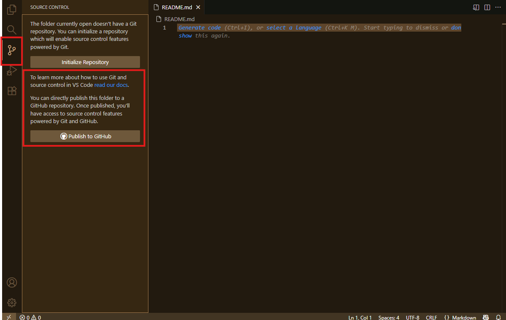
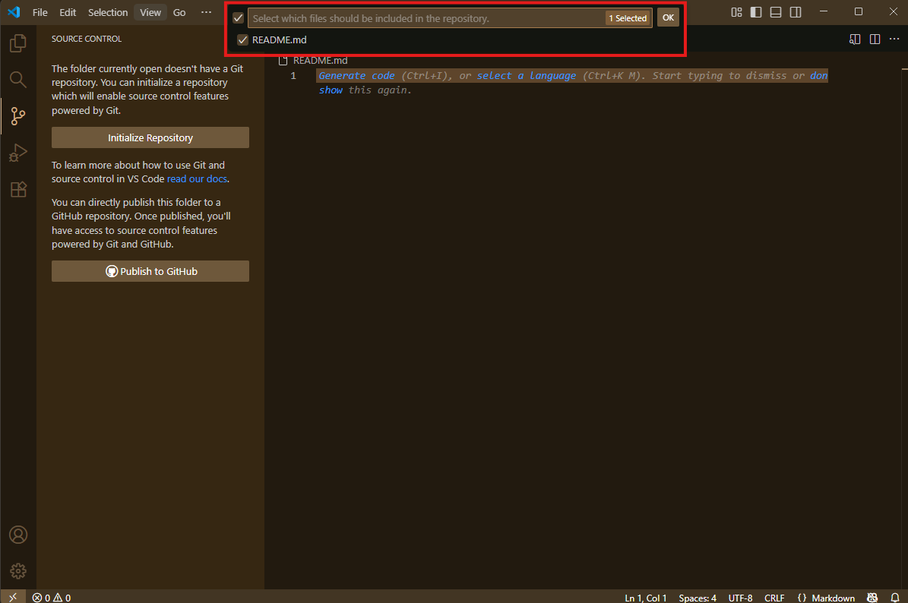

# 🚀 Empezando con GitHub

## Creando un nuevo repositorio

Para empezar un repositorio hay dos formas principales de hacerlo: directamente desde GitHub o desde un editor como Visual Studio Code (VS Code). ¡Vamos paso a paso!

---

### 🟢 Como crear un repositorio desde GitHub

1. **Ir a la página principal de GitHub**  
   Haz clic en el botón verde o en la parte superior derecha y selecciona **"Crear nuevo repositorio"**.

   

2. **Configurando el repositorio**  
   En la siguiente pantalla podremos:
   - Elegir el **nombre** del repositorio y el **propietario**.
   - Definir si será **público** o **privado** (esto determina la visibilidad).
   - Cuando tengamos los datos en orden podremos hacer Click en **"Crear repositorio"**.

   

3. **Getting Started de GitHub**  
   GitHub te mostrará una guía rápida para configurar tu repositorio y distintas formas de conectar tu editor de texto.

   

---

¡Listo! Ya tienes tu repositorio creado en GitHub. Ahora vamos a configurarlo para trabajar desde tu editor de texto.

---

#### 💻 Configuración de Visual Studio Code

4. **Abrir VS Code**  
   Selecciona la carpeta donde vas a almacenar tu repositorio.

   

5. **Explorador y terminal**  
   - A la izquierda tienes el **explorador de archivos** para ver y crear carpetas/archivos.
   - Abajo está la **terminal integrada**. Puedes abrirla con el atajo:  
     **Ctrl + Shift + ñ** o **Ctrl + Shift + `** (según tu configuración).

   

6. **Conectar el repositorio local con GitHub**  
   En la terminal, ejecuta los siguientes comandos:

   ```bash
   git init
   git remote add origin TuURL.git
   ```

   > Reemplaza `TuURL.git` por la URL de tu repositorio en GitHub.

---

¡Con esto ya tienes tu repositorio local conectado con GitHub y listo para trabajar desde VS Code! Ahora puedes crear, editar y sincronizar tus archivos fácilmente.

---

### 🟣 Cómo crear un repositorio desde VS Code

1. **Abrir VS Code y crear una carpeta**  
   Abre VS Code, selecciona una nueva carpeta y crea un archivo, por ejemplo: `README.md`.
   >💡 **Recuerda:**  
   > La extensión `.md` corresponde a **Markdown**, un formato de texto ligero que permite dar formato y estructura a tus documentos de manera sencilla, similar a un bloc de notas pero con opciones de estilo y organización.  

   

   Así se verá tu espacio de trabajo:

   

2. **Ir al control de versiones**  
   Haz clic en el ícono de control de versiones (barra lateral izquierda). Aparecerán dos opciones, selecciona **Publicar en GitHub**.

   

3. **Configurar el repositorio**  
   En la parte superior aparecerá una ventana para configurar el nombre y la visibilidad del repositorio (público o privado).

   

   Confirma los archivos que se subirán (por ejemplo, `README.md`) y haz clic en **OK**.

   

---

¡Listo! Así terminas de crear y conectar tu repositorio con GitHub directamente desde VS Code, todo en unos pocos clics.

---

En resumen, crear y conectar un repositorio en GitHub es un proceso sencillo tanto desde la web como desde VS Code. Siguiendo estos pasos, puedes comenzar a gestionar tus proyectos de forma organizada y colaborativa en pocos minutos.