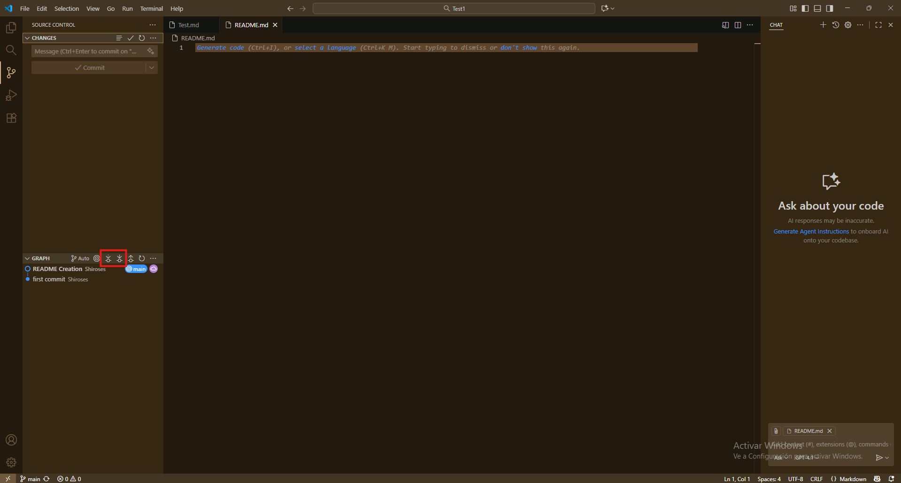
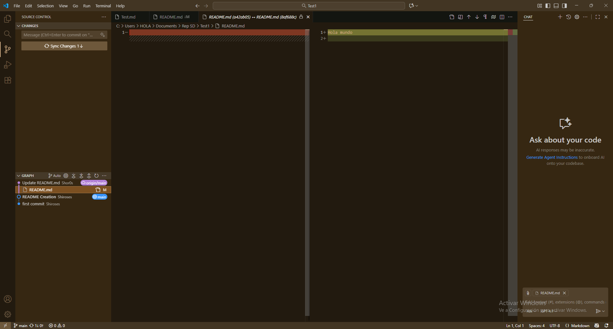

# 🚀 Empezando con GitHub

## 🔄 Trayendo cambios desde el repositorio remoto

A veces estamos trabajando desde dos dispositivos o hay varias personas colaborando en el mismo proyecto. En estos casos, es importante mantener el proyecto local sincronizado con el repositorio remoto. Para esto existen dos comandos principales: **pull** y **fetch**.

Aunque son parecidos, se usan de manera diferente:

- **pull**: Actualiza tu computadora con los cambios del repositorio remoto. Esto significa que toma el contenido remoto y sobreescribe lo que tengas en tu proyecto local. Si se borró un archivo en el remoto, también se borrará en tu local. Por eso, es recomendable usarlo solo si trabajas solo o sabes exactamente qué cambios se hicieron, para evitar confusiones.

- **fetch**: Trae los cambios del repositorio remoto, pero **no los aplica** automáticamente. Así puedes revisar qué cosas cambiaron antes de integrarlas, sin correr el riesgo de perder archivos locales.

> 💡 **Consejo:**  
> Usa cada comando según tu flujo de trabajo y la colaboración en tu equipo.

---

### 🟣 Situación Fetch

Imagina que es un proyecto de dos personas: tu compañero hizo unos cambios en la noche y ahora tú necesitas continuar con el proyecto. Veamos cómo hacerlo de forma segura.

---

## 💻 Fetch desde la Terminal

1. **Abrir la terminal integrada en VS Code**  
   Usa el atajo `Ctrl + Shift + ñ` o ve al menú `Terminal` y selecciona `Nueva Terminal`.

2. **Traer los cambios del repositorio remoto sin aplicarlos**  
   Ejecuta el siguiente comando:

   ```bash
   git fetch origin
   ```

3. **Ver el historial de cambios traídos desde el remoto**  
   Usa este comando para revisar los commits nuevos:

   ```bash
   git log origin/main
   ```
   > Donde `main` es el nombre de la rama que quieres revisar.

4. **Comparar tu rama local con la remota**  
   Si quieres ver la diferencia entre tu rama local y la remota, ejecuta:

   ```bash
   git diff main origin/main
   ```
   > Así puedes comparar los cambios entre tu rama local `main` y la rama remota `origin/main`. Recuerda cambiar los nombres de las ramas si es necesario.

De esta forma, puedes usar `fetch` para mantenerte informado de los cambios en el repositorio remoto antes de aplicarlos a tu proyecto local.

---

### 🔀 ¿Qué es Merge y cómo se usa en la Terminal?

Si estás de acuerdo con los cambios traídos con `fetch`, puedes combinarlos con tu rama local usando **merge**.  
El comando `merge` en Git sirve para unir dos ramas, integrando los cambios de una en otra.

5. **Confirma que estás en tu rama principal (`main`)**  
   Ejecuta:

   ```bash
   git checkout main
   ```
   > Si sabes que estás en la rama principal puedes saltarte este paso.

6. **Combina los cambios de la rama remota con la local**  
   Ahora, aplica el merge:

   ```bash
   git merge origin/main
   ```

   > Esto integrará los cambios de `origin/main` en tu rama local `main`. Si hay conflictos, Git te avisará para que los resuelvas manualmente.

---

¡Y así has sincronizado tu proyecto local con el repositorio remoto desde la terminal!

---

Ahora vamos a hacer lo mismo desde la interfaz de VS Code.

## 💻 Fetch desde VS Code

1. **En la ventana de control de versiones y en la pestaña de historial**  
   Podemos ver varios botones de izquierda a derecha: el selector de ramas, volver al punto actual de la rama, fetch, pull, push y actualizar el historial.

   

   Vamos a enfocarnos en las ramas y en fetch.  
   - Con el botón de **ramas** puedes cambiar qué ramas se muestran en la pestaña del historial.
   - Con el botón de **fetch** traes los cambios del repositorio remoto al historial **sin aplicarlos**. Además, podrás ver una previsualización de los cambios si los seleccionas.

2. Haz clic en el botón de fetch para traer los cambios.  
   Verás que aparece un commit de otro color; estos colores son autoasignados para facilitar la diferenciación de las ramas. Ahora puedes previsualizar los cambios haciendo clic en el commit y seleccionando el archivo editado.

   En la previsualización se abren dos ventanas: a la izquierda el archivo viejo y a la derecha el más nuevo. Las líneas rojas indican datos borrados y las verdes, datos agregados.

   

---

Ya tienes los cambios del repositorio remoto. Ahora hay que combinarlos con la rama principal usando un `merge`.

### 🔀 Merge desde VS Code

En VS Code no se puede hacer un merge directamente desde la interfaz, pero puedes hacerlo usando un **pull**, que explico a continuación.

---

## 💻 Pull desde la Terminal

Para hacer un pull (es decir, hacer un fetch y merge automáticamente)

1. **Ejecuta el siguiente comando en la terminal:**

   ```bash
   git pull origin main
   ```

Con este comando traerás y aplicarás los cambios del repositorio remoto a tu proyecto local de forma automática.

---

## 💻 Pull desde VS Code

Para hacer un pull desde VS Code
1. **En la ventana de control de versiones**
   
   Haz clic en el botón de **pull** en la pestaña de historial. Esto traerá y aplicará todos los cambios del repositorio remoto.

   También puedes usar el botón de **sincronizar**. Esto realiza un pull y un push, priorizando los archivos más recientes para la sobreescritura.

   

---

Realizar fetch, merge y pull es fundamental para mantener tu proyecto actualizado y sincronizado, especialmente cuando trabajas en equipo. Ya sea desde la terminal o desde la interfaz de VS Code, estos comandos te ayudarán a colaborar de manera eficiente y segura.