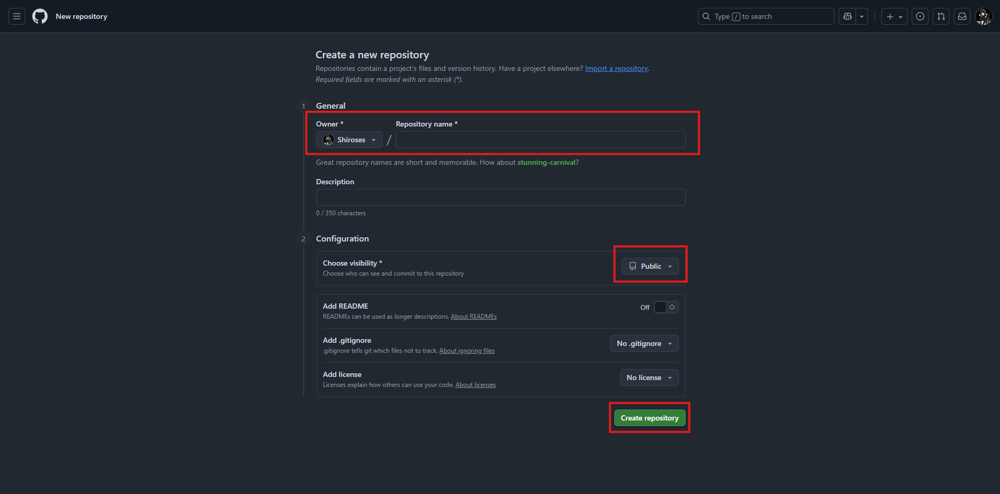
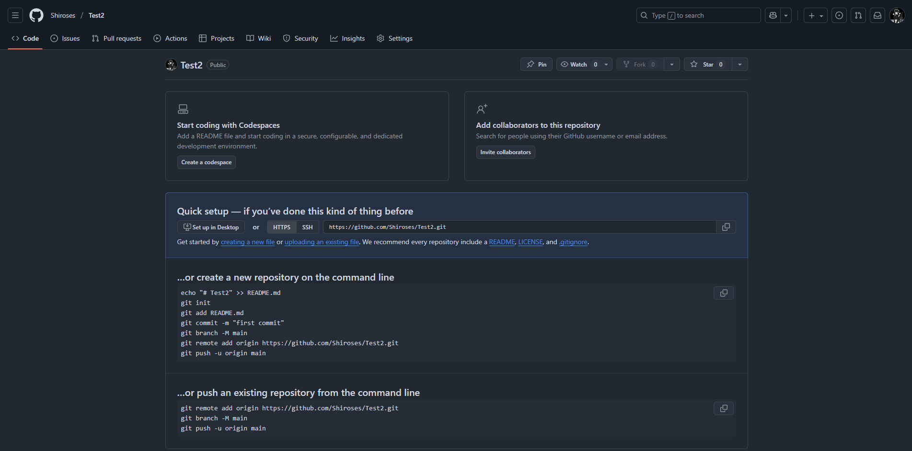
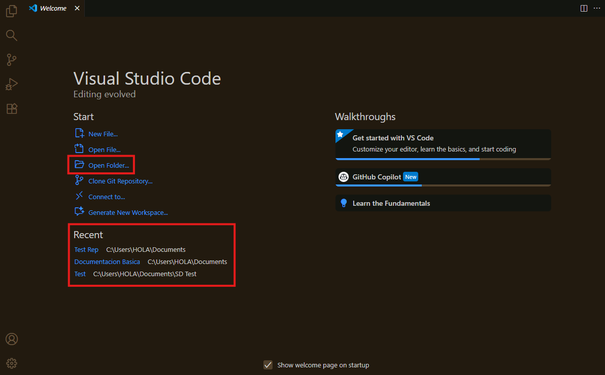

# 🚀 Getting Started with GitHub

## Creando un nuevo repositorio

Para empezar un repositorio hay dos formas principales de hacerlo: directamente desde GitHub o desde un editor como Visual Studio Code (VS Code). ¡Vamos paso a paso!

---

### 🟢 Como crear un repositorio desde GitHub

1. **Ir a la página principal de GitHub**  
   Haz clic en el botón verde o en la parte superior derecha y selecciona **"Crear nuevo repositorio"**.

   

2. **Configurando el repositorio**  
   En la siguiente pantalla podremos:
   - Elegir el **nombre** del repositorio y el **propietario**.
   - Definir si será **público** o **privado** (esto determina la visibilidad).
   - Cuando tengamos los datos en orden podremos hacer Click en **"Crear repositorio"**.

   

3. **Getting Started de GitHub**  
   GitHub te mostrará una guía rápida para configurar tu repositorio y distintas formas de conectar tu editor de texto.

   

---

¡Listo! Ya tienes tu repositorio creado en GitHub. Ahora vamos a configurarlo para trabajar desde tu editor de texto.

---

#### 💻 Configuración de Visual Studio Code

4. **Abrir VS Code**  
   Selecciona la carpeta donde vas a almacenar tu repositorio.

   

5. **Explorador y terminal**  
   - A la izquierda tienes el **explorador de archivos** para ver y crear carpetas/archivos.
   - Abajo está la **terminal integrada**. Puedes abrirla con el atajo:  
     **Ctrl + Shift + ñ** o **Ctrl + Shift + `** (según tu configuración).

   

6. **Conectar el repositorio local con GitHub**  
   En la terminal, ejecuta los siguientes comandos:

   ```bash
   git init
   git remote add origin TuURL.git
   ```

   > Reemplaza `TuURL.git` por la URL de tu repositorio en GitHub.

---

¡Con esto ya tienes tu repositorio local conectado con GitHub y listo para trabajar desde VS Code! Ahora puedes crear, editar y sincronizar tus archivos fácilmente.

---

### Como crear un Repositorio desde VS Code

1. Abrimos VS Code y creamos una nueva carpeta

