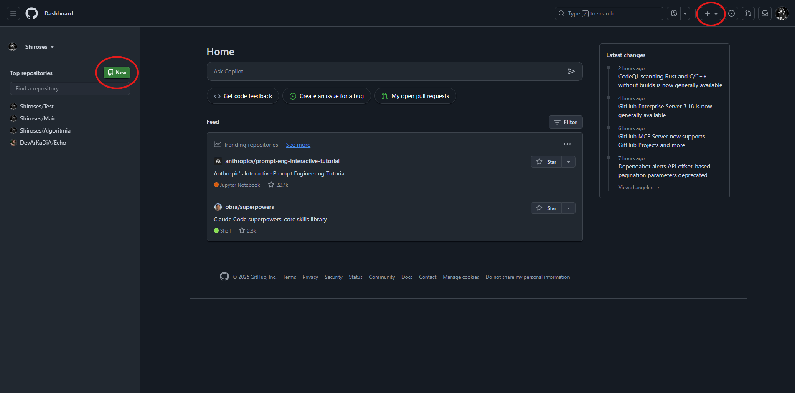

# Getting started with Github

## starting a new repository

para empezar un repositorio hay dos formas de hacerlo, directamente desde Github o desde un editor como lo es VS Code, asi que empecemos!

### Creating with Github

en este caso para crear un repositorio desde Github hay distintos pasos a seguir y puede ser un poco mas laborioso:

1. Vamos a la pagina principal de Github y hacemos click en el icono verde o en la parte de arriba a la derecha y seleccionamos crear nuevo repositorio

2. 